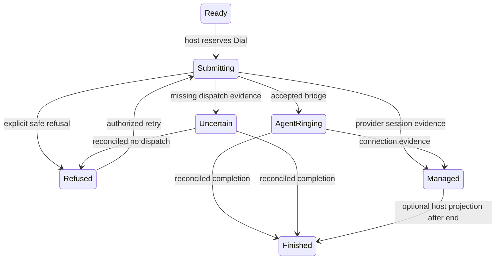

# ClientCallWorkspace

`ClientCallWorkspace` is the opinionated calling composition for a client work
surface. It combines identity, destination editing, saved numbers, an optional
contact-number write, dispatch evidence, managed call controls, guidance and an
explicit call record. The host owns authorization, provider operations, drafts,
persistence and dismissal. No network, audio, storage or routing operation runs
inside this component.

The [Office research report](../research/2026-09-09-office-softphone-workspace.md)
explains the source evidence, contradictions and design decision. For a smaller
client call console, use [Softphone](softphone.md) directly. The
[original verification record](../verification/client-call-workspace-2026-09-09.md)
and [Office adoption verification](../verification/client-call-workspace-adoption-2026-09-09.md)
contain gate results and reviewed responsive screenshots for their respective candidates.

## Public API and ownership

All types are exported from `leptos_daisyui_rs::components::*`.

| Prop | Contract |
|---|---|
| `id: String` | Unique DOM region identity. Prefixes destination pad and managed Softphone IDs. |
| `state: Signal<ClientCallWorkspaceState>` | One atomic host projection; do not splice unrelated client and request signals into the UI. |
| `on_command: Callback<ClientCallCommand>` | Receives guarded requests. Adopt edits or reserve pending state synchronously before returning. |
| `texts: Signal<ClientCallWorkspaceTexts>` | Optional reactive copy, including all fixed outcome labels and nested Softphone copy. Defaults to English. |
| `now_ms: Option<Signal<i64>>` | Optional epoch clock. Browser default ticks once per second; native default is zero. |
| `class: &'static str` | Optional outer classes. The default is a bordered, rounded, bounded region. |

`ClientCallWorkspaceState.call` is the single canonical `SoftphoneState`,
including `context_id`, client identity and saved-number choices. During a
managed call it also supplies phase, timer, selected dialed number, capabilities,
pending live command and failure. The workspace does not maintain a second
client identity. `destination` is a separate *draft*, not an assertion about the
connected party. On confirming a managed session, the host must set the
Softphone's selected number to the actual dialed destination, adding that number
to the projected choices if necessary.

`context_id` must encode or refer to the host's actor, client, authorization
generation and attempt. Blank context fails closed, including dismissal. Change
the identity when any of those scopes changes; never recycle it while an old
operation can still resolve. `state.accepts(&command)` checks context and current
eligibility. Async replies require an additional host operation token and an
attempt registry; this helper does not reject same-context out-of-order replies.

The component has only one local state: whether its destination pad is open.
That state closes when context changes or editing becomes unavailable. All
drafts survive or disappear according to the host's state, not component mount
lifetime. Saved-number rendering is memoized independently of draft edits so
ordinary input does not remount the saved choices.

## Fixed element inventory

| Element | Content and behavior |
|---|---|
| Header | Workspace label, client name, supporting case/account text, visible Close action. Long identity text wraps. |
| Attempt band | Structured state in words, optional safe server explanation, bridge/unknown explanations, final stopped duration when supplied. Polite live status. |
| Destination field | Labeled telephone input; host value, max 64 characters, host validation error, explanation that editing does not update the contact. |
| Saved numbers | Ordered labeled choices from `call.client.phones`. Blank/duplicate IDs, blank numbers, oversized numbers and numbers with `blocked_reason` cannot be selected. Blocked choices remain visible with an explanation. No numbers shows explicit empty copy. |
| Number pad | Local disclosure, twelve destination-editing keys, backspace. Appends one character or removes the final Unicode character. Never sends DTMF. |
| Contact update | Present only for `number_update: Some`. Optional controlled target Select, exact field label, confirmed saved value, Save contact number, permission explanation, pending state and failure. |
| Place call | Primary action for the exact current draft; disabled for missing identity, readiness, validation, pending or dispatched attempts. |
| Managed console | Existing Softphone for a live managed phase. Mute, hold, voicemail, record, transcribe, DTMF and End follow that component's capabilities and guards. |
| Guidance | Optional title, plain-text objective and source label, ordered script beats, preparing/failed evidence and optional host-owned regeneration action. |
| Provider talk time | Separately labeled confirmed seconds, formatted as a duration. Unknown differs from a confirmed zero; never populates manual minutes or establishes connection. |
| Call record | Optional explicit outcome, notes, manual duration, conditional callback instructions and Save call record. |
| Dismiss | Context-bearing close proposal. It never ends a call, clears an attempt or discards notes. |

The same DOM stacks at compact widths; at a component width of 48rem it uses two
equal columns. A container query measures the workspace itself, so a narrow
desktop drawer also stacks. Calling is first, guidance and record second. There are no duplicate
hidden forms or custom layout slots. With both optional guidance and wrap-up
absent, the second column is empty by design; use Softphone for a minimal
console. Supported features that are temporarily unavailable stay visible with
disabled actions. Entire unsupported optional sections are absent.

The composition sets label and button gaps to the shared 8px step, allows field
help to wrap, and uses flat input/select/textarea surfaces with their native
focus treatment retained. Its scoped visual audit has zero ceilings for every
family. Container behavior follows [Tailwind's container-query contract](https://tailwindcss.com/docs/responsive-design#container-queries).

## Dispatch state machine

| `ClientCallAttempt` | Meaning | Destination / launch | Completion save |
|---|---|---|---|
| `Ready` | No dispatch yet | Allowed subject to all guards | Blocked |
| `Submitting` | Host reserved dispatch | Locked | Blocked |
| `AgentRinging` | Bridge accepted; agent's telephone ringing | Locked; no connected clock or browser controls | Blocked |
| `Uncertain` | Dispatch may have happened | Locked until host reconciles; no Retry shortcut | Blocked |
| `Refused` | Explicit evidence that retry is safe | Allowed subject to readiness | Blocked |
| `RefusedWith(reason)` | Typed `AgentNotReady`, `AgentNotAvailable` or `NotSubmitted` evidence | Allowed subject to readiness; reason remains distinct in copy and DOM | Blocked |
| `Finished` | Host established attempt completion | Locked; start another attempt through the host | Allowed if draft valid and call not live |
| `Managed` | Host provides real media lifecycle | Destination locked; Softphone shown only while phase is live | Allowed only for `Ended` with no pending live command |

`Refused` is a structured assertion about safe retry, not a synonym for an HTTP
failure. Map missing responses to `Uncertain`. `AgentRinging` never starts a
timer. A managed phase of `Ready` is not a usable launch state; begin with a
workspace Ready attempt and move to managed Dialing/Ringing/Active only on host
evidence. Ended managed calls do not expose the nested Softphone's Call action,
preventing a second launch that bypasses workspace readiness and wrap-up guards.

For bridge states keep the nested phase non-live and its pending field empty;
the attempt field represents dispatch. For managed states the nested pending
field represents only live-session operations. A contradictory `Finished` with
a live phase cannot save an outcome. The component does not infer completion
from text, duration or drawer dismissal.



These arrows describe host updates, not an internal reducer. The host may keep
`Managed + Ended` instead of projecting Finished. It must not reset an ambiguous
attempt when closing, reopening or switching a drawer.

## Command contract

Every `ClientCallCommand` contains the current `context_id` and one action.
Commands are requests; rendering does not optimistically confirm their effect.

| Action | Payload and repeated callback guard | Host acknowledgment |
|---|---|---|
| `EditDestination` | Replacement string, at most 64 characters; editing allowed | Adopt draft and recalculate validation atomically, or reject and retain old draft |
| `ChooseSavedNumber` | Unique valid number ID from current choices | Copy the authorized saved number into destination and validate |
| `ChooseNumberTarget` | Unique, nonblank, permitted target ID; destination editing allowed and no pending contact write | Adopt only the selected field ID; no contact write occurs |
| `SaveNumber` | Exact current field ID and destination; nonblank valid changed value, writable capability | Set update pending before returning; on success update confirmed saved value and choices; on failure retain both draft and old value |
| `RegenerateGuidance` | Present regeneration capability; no blocked reason; Idle, Succeeded or Failed state | Reserve Busy synchronously; Accepted means submitted, Succeeded requires a correlated completed result |
| `Dial` | Exact current draft; readiness reason absent, validation error absent, no pending write/live command | Reserve Submitting and operation token before returning, then dispatch once |
| `SetOutcome` | One of six outcomes or None | Adopt/clear explicit selection; never substitute a default |
| `SetNotes` | At most 8,000 characters | Adopt draft only |
| `SetDurationMinutes` | At most 10 characters | Adopt raw draft; validation may prevent later save |
| `SetFollowUp` | At most 1,000 characters and callback outcome selected | Adopt written instructions; no scheduling implied |
| `SaveWrapUp` | Exact validated snapshot equal to current draft; finished and not pending/saved | Set wrap-up pending synchronously; confirm saved only after persistence |
| `Session` | Existing Softphone action except Call/SelectNumber; repeats Softphone guards | Reserve live pending kind, then update confirmed state or failure |
| `Dismiss` | No payload besides context | Persist/protect draft and close through the consumer's own policy |

Contact saving blocks destination editing and launch, but does not block drafting
notes. Pending/saved wrap-up freezes its fields and prevents launching another
call against the completed record. With the Softphone `end_call` capability,
End call remains possible while another live control is pending; a duplicate
End request remains blocked. Application authorization still belongs in every
host handler and server endpoint.

The Input, Textarea and Select callbacks restore the DOM value from host state
after each proposal. A rejected edit therefore cannot leave the visible control
showing a value the host never adopted. The outcome selector remains mounted
through unrelated state changes; localization updates labels without commands.

## Work record validation

Outcomes are `Interested`, `NotInterested`, `NoResponseBusy`,
`RequestedMoreInfo`, `RequestedCallBack`, and `InvalidNumber`. The native Select
has a blank prompt and required semantics. A callback shows a required textarea
asking who should act and when. This is a text record, not a scheduled event;
applications needing a structured appointment must handle that separately.

`ClientCallWrapUp::payload()` returns None for missing outcome, oversized notes
or instructions, missing callback instructions, or invalid duration. Duration
accepts an optional positive decimal `u32` in whole minutes. Blank means None;
zero, negative, fractional, non-digit and overflowing values are rejected.
Whitespace is trimmed on submission. Notes remain empty if the operator typed
nothing. Follow-up text is included only for the callback outcome, even if an
older callback draft remains in host memory after changing outcome.

Validation does not invent a duration from the live timer. The timer follows
Softphone's seconds/epoch contract, while the work-record field is an explicitly
manual minute value. The component's maximum lengths limit UI payload size;
consumers may apply stricter business validation before persisting.

## Structured guidance and regeneration

`ClientCallGuidance` retains `title`, `body` and `source` for a plain objective.
Add `beats` to render an ordered script. Each `ClientCallScriptBeat` has an
opaque `id`, a `title`, a suggested `say` line and `no_file_detail`. The host
supplies the vector in intended order and resolves language before projection.
The no-file-detail marker explicitly identifies generic guidance; it is never
inferred from absent prose. Content is plain text. Replacing content with the
same beat ID must update the rendered text.

`ClientCallGuidanceState::Ready` presents the beats. `Preparing` presents the
host's `elapsed_secs` and `typical_secs` side by side; neither implies progress
or a completion deadline. `Failed { reason }` presents the failure explanation.
The title, objective and source remain available in all three states, but old
beats are not presented as a ready script while preparing or failed.

`regeneration: None` hides the action. A present `ClientCallRegeneration` carries
its mutation state, optional blocking explanation and optional failure. Busy
and Accepted prevent duplicate requests. Accepted is not Succeeded: keep the
generation state Preparing until the host receives the completed script. A
failure retains host draft/content and allows retry unless `blocked_reason`
forbids it. The Office comparison-lock 409 is an error plus a blocking reason,
not a successful regeneration. Only the host can clear that block.

Keep separate operation tokens for regeneration and telephony/contact writes.
Reject old context or old operation replies before replacing guidance. The
workspace emits the context envelope but does not implement asynchronous jobs,
polling, permission checks, retries or request-token storage.

## Contact targets and number eligibility

`ClientCallNumberUpdate.targets` supplies the authorized target choices. Its
existing `field_id` is the controlled selection. Each target owns its label,
confirmed saved number and optional blocking reason; when targets are present,
`selected_target()` resolves the selection from this vector. Blank or duplicate
IDs cannot be selected or saved. Pending contact writes freeze target changes.
When targets is empty, the original single-field fields remain the source of
truth, allowing existing simple integrations to keep their layout.

The host must update the exact acknowledged target after a save. Writing a
Mobile field does not make that number callable. Project callability separately
through `SoftphoneNumber.blocked_reason`. The component rejects selecting blocked
numbers and rejects dialing their exact trimmed text even if it was typed into
the destination. The host must normalize and authorize every destination: this
UI guard cannot establish that differently formatted phone strings are equivalent.

`provider_talk_seconds: None` means no confirmed measurement; `Some(0)` is a real
zero. Convert Office's signed seconds only after rejecting negative values.
This metric is separate from ring-inclusive provider duration, the managed
session's elapsed clock (which includes hold/reconnect), and operator-entered
wrap-up minutes. None of these values supplies telephony control permissions.

## API migration

The calling enums are now `#[non_exhaustive]`. Downstream matches need a wildcard
arm, and unknown commands must produce no side effect. Adding this attribute to
an existing enum is itself a source compatibility change; it allows future
variants without requiring every consumer to update an exhaustive match. See the
[Rust reference](https://doc.rust-lang.org/reference/attributes/type_system.html#the-non_exhaustive-attribute)
and [Cargo compatibility guide](https://doc.rust-lang.org/cargo/reference/semver.html#attr-adding-non-exhaustive).

Update full `SoftphoneNumber`, `ClientCallGuidance`, `ClientCallNumberUpdate`,
workspace state and texts literals with the new fields or `..Default::default()`.
Existing `Refused` remains supported for explicit safe retry; new Office adapters
should use `RefusedWith` to preserve evidence. These changes require a reviewed
vendor update and foundation digest repin in Office before adoption.

## Integration example

```rust,ignore
let state = RwSignal::new(ClientCallWorkspaceState {
    call: SoftphoneState {
        context_id: "actor-7/client-42/generation-3/attempt-9".into(),
        client: SoftphoneClient {
            name: "Elena Martinez".into(),
            subtitle: "Case 10428 · Account review".into(),
            ..Default::default()
        },
        ..Default::default()
    },
    dial_blocked_reason: None, // host has established authorization/readiness
    ..Default::default()
});
let on_command = Callback::new(move |command: ClientCallCommand| {
    if !state.with_untracked(|s| s.accepts(&command)) { return; }
    match command.action {
        ClientCallAction::EditDestination(value) => state.update(|s| {
            s.destination = value;
            s.number_error = validate_for_our_provider(&s.destination);
        }),
        ClientCallAction::Dial { number } => {
            state.update(|s| s.attempt = ClientCallAttempt::Submitting);
            // Host creates an operation token, dispatches asynchronously, and
            // checks both context and operation token before applying evidence.
            dispatch_with_our_attempt_registry(command.context_id, number);
        }
        other => handle_other_workspace_request(command.context_id, other),
    }
});
view! { <ClientCallWorkspace id="client-call" state=state on_command=on_command /> }
```

The named adapter functions above are application-owned. The complete simulated
host is [the showcase](../../demo/src/demos/client_call_workspace.rs) at
`/components/client-call-workspace`. Accept/Reject are simulator controls outside
the component. New attempt resets the simulated host; Switch client retains a
pending old response so stale acknowledgment can be exercised. The simulator
counts every callback before its own guard, and separately counts confirmed
writes, so consumer guards cannot conceal extra component emissions in tests.

For an Office adapter, preserve its route-specific target lookup and attempt
registry. Map explicit provider refusal/no-dispatch evidence to RefusedWith, accepted
bridge launches to AgentRinging and ambiguous responses to Uncertain. Enable
number update only with the exact authorized field mapping. Map work completion
to the correct work-kind API; the six outcome labels do not identify the route.

Office adapter mapping for `op-zhksn` / `ldui-26tv`:

| Office evidence | Library projection |
|---|---|
| `AgentNotReady` local preflight | `RefusedWith(AgentNotReady)`; retain readiness explanation |
| `AgentNotAvailable` provider refusal | `RefusedWith(AgentNotAvailable)`; never claim no POST occurred |
| Explicit `dispatch_evidence: not_submitted` | `RefusedWith(NotSubmitted)` |
| Missing or contradictory evidence | `Uncertain`; retain retry lock |
| Ordered `CallScriptBeat` values | Resolve bilingual text, preserve order and `no_file_detail` |
| `CallScriptStateDto` | Ready/Preparing/Failed guidance; preserve reason and measured timing |
| Contact kind `phone` / `mobile` | Authorized target IDs mapped by host; do not infer dialability |
| `CallStateDto.talk_time` | Validated nonnegative `provider_talk_seconds`, with None preserved |

Office's call-state endpoint provides observation, not browser media controls.
Only enable managed commands for a provider adapter that can actually perform
them. Structured payment promises remain an Office-owned commitment workflow;
the voice component can sit inside a broader omnichannel engagement workspace.

## Accessibility, testing and maintenance

This is a named inline section, not a dialog. Compose it inside LDUI Modal when
a modal drawer is required. The host retains the opener, focus return and dirty
draft confirmation. Close is always distinct from End call. All actions use
real buttons; fields use Field associations and required semantics. The live
console retains its non-announcing timer and capability/phase cleanup behavior.

Native behavior tests are co-located in `tests.rs` and run in the existing
`cargo xtask verify` library lane. Focus them with
`cargo test -p leptos-daisyui-rs --lib client_call_workspace`.
Release browser tests are included in `tests/softphone_smoke.rs` through
`tests/softphone/workspace.rs`; run `cargo xtask test-softphone`. They cover
real saved-number/pad/keyboard interactions, pending and rejected writes, stale
host acknowledgment, required fields, managed controls, compact geometry,
screenshots, axe and prohibited duplicate callbacks. Their native select
sequence is focus, Space, Home/Arrow, Enter, then value and host readback.

Keep optional field sections stable across ordinary edits. Never replace the
entire form whenever state changes. Keep keypad effect reads unconditional so
both context and availability changes close it. Do not reinterpret provider
errors from text, add automatic retry, or reset dispatch evidence on dismissal.
New operations need typed payloads, capability and pending rules, host receipts
and explicit evidence of the resulting UI state.
