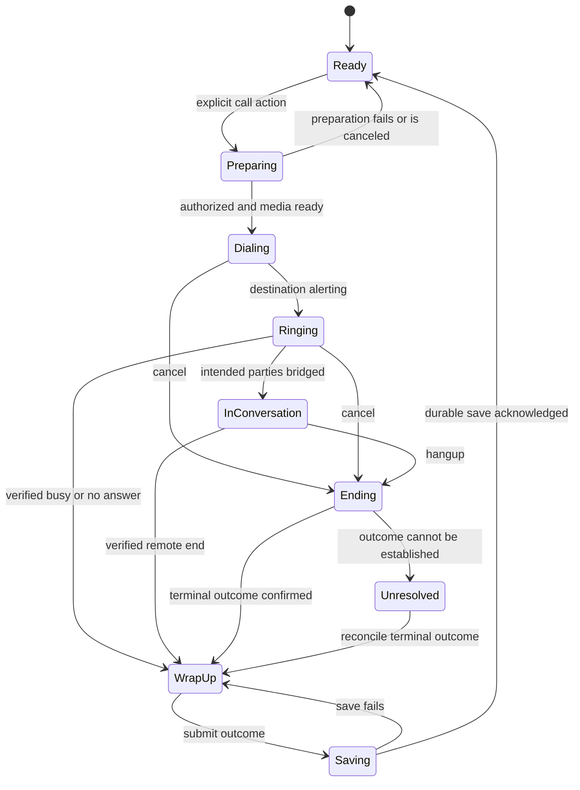

# Browser softphones and an opinionated client calling workspace

**Research date:** 4 September 2026 (America/Los_Angeles). **Audience:** LDUI maintainers and consuming application owners. **Bead:** ldui-y4fz. **Status:** researched recommendation; proposed component names and contracts are not implemented APIs.

**Recommendation:** build `ClientCallWorkspace<T>`: a complete, native LDUI workflow for calling a known client, maintaining context during the conversation, and saving its outcome. Mount one persistent `CallSession` above the application's router. Use one provider adapter for the first deployment, provisionally Twilio when there is no existing telephony commitment. Keep Telnyx as the principal alternative; assess an existing WebRTC-capable SIP PBX before replacing it.

The defining contract is **one interaction, one authoritative state projection, one set of controls**. The component owns interaction behavior and layout. The consuming application owns client data, authorization, telephony configuration, and durable records. That follows the existing [EntityTable](../components/entity_table.md) and [client snapshot page](../patterns/client-snapshot-list.md) ownership model.

## Scope and assumptions

The assumed first use is a staff member on a desktop browser calling a client's ordinary telephone number through a headset. The client does not need to install software or open a web page. Browser-to-browser calling is a different destination type and can follow later. Initial support should target current Windows Chrome and Edge, with other browsers qualified through actual testing.

The existing provider/PBX, destination countries, call volume, inbound requirement, and system of record have not been confirmed. The provider recommendation is conditional on those inputs. This research reviewed official product documentation, SDK references, standards, and public rate cards. It did not place calls, benchmark audio quality, inspect an account's entitlements, or verify negotiated commercial terms. No provider wins a reliability or cost ranking on this evidence alone.

## The three implementation routes

| Route | What we own | What we inherit | Judgment for this component |
|---|---|---|---|
| **Custom LDUI interface with a programmable voice SDK** | Complete calling workflow, appearance, client context, normalized state | Provider media SDK and server APIs | **Recommended** when we want EntityTable-level consistency across applications. |
| **Custom LDUI interface with SIP.js or JsSIP and an existing PBX** | Same UI contract plus SIP integration | Existing trunks, routing, extensions, recording and operations | Prefer when that infrastructure already works and exposes the necessary browser and event interfaces. |
| **Embed a vendor's finished softphone** | Surrounding client context and supported integration callbacks | Vendor controls, account model, layout and release behavior | Fast integration when already subscribed; a weaker fit for a fully governed LDUI composition. |

WebRTC supplies browser media connections; its signaling mechanism is separate. A PSTN call also needs a provider or PBX/trunk bridge. A TURN relay addresses media connectivity; it does not supply telephone-number routing. See [WebRTC peer connections](https://webrtc.org/getting-started/peer-connections?hl=en) and [Twilio's browser-to-server routing model](https://www.twilio.com/docs/voice/sdks/javascript).

## What existing softphones teach us

| Reference | Verified behavior | Design consequence |
|---|---|---|
| **Aircall Workspace / Everywhere V2** | Workspace combines mute, hold, keypad, transfers, notes, device settings and quality indicators. Everywhere V2 embeds that existing experience in an iframe; V1 is deprecated. | Keep context and common controls together. Treat this as a finished product integration, rather than a headless engine. [In-call actions](https://support.aircall.io/en-gb/articles/21534383206685), [embedding overview](https://developer.aircall.io/docs/embed). |
| **RingCentral Embeddable** | Offers browser call commands and events, and a call-logging integration keyed by session identity. Its documentation distinguishes browser calling from RingOut. | Separate the call session, provider commands and business logging. Use the browser media route for this requirement. [Events](https://ringcentral.github.io/ringcentral-embeddable/docs/integration/events/), [API](https://ringcentral.github.io/ringcentral-embeddable/docs/integration/api/), [call logging](https://ringcentral.github.io/ringcentral-embeddable/docs/integration/call-logging/). |
| **Amazon Connect CCP / Streams** | Streams supports embedded or custom interfaces. The softphone host must remain alive during the call. After-contact work is distinct from the conversation ending. | Mount media at application scope; hangup transitions into wrap-up. [Streams](https://github.com/amazon-connect/amazon-connect-streams), [agent settings](https://docs.aws.amazon.com/connect/latest/adminguide/configure-agents.html). |

Aircall's always-on-top floating toolbar is a desktop-app feature, so it is not a browser requirement we should promise. Its recording control also depends on number configuration. These are useful reminders to distinguish visual precedent from actual browser capability. [Aircall in-call actions](https://support.aircall.io/en-gb/articles/21534383206685).

**Our synthesis:** a business softphone should be centered on the client and conversation. The numeric keypad is secondary. Device recovery, pending commands and unsaved outcomes deserve first-class presentation because they determine whether the work actually completes.

## Provider assessment

| Candidate | Integration and capabilities supported by primary evidence | Fit and limitation |
|---|---|---|
| **Twilio Voice JavaScript SDK** | Browser `Device`; server-issued access tokens; backend TwiML routing. Browser mute and DTMF; conferences/server resources for richer hold and transfer workflows. | Recommended reference adapter because its documented routing and lifecycle fit a clean frontend/backend boundary. This is an engineering judgment, not a measured quality advantage. [Overview](https://www.twilio.com/docs/voice/sdks/javascript), [tokens](https://www.twilio.com/docs/iam/access-tokens), [conference model](https://www.twilio.com/docs/voice/conference). |
| **Telnyx WebRTC JavaScript SDK** | Browser calls with JWT/credential provisioning; SDK hold/unhold, mute, DTMF and device switching. Recovery may replace the Call object and expose `recoveredCallId`. | Strong alternative, particularly with existing Telnyx connectivity. Reconcile recovery by stable interaction identity; verify outbound profile and chosen routing model. [Quickstart](https://developers.telnyx.com/development/webrtc/js-sdk/quickstart/index), [Call reference](https://developers.telnyx.com/docs/voice/webrtc/js-sdk/classes/call), [recovery/error handling](https://developers.telnyx.com/docs/voice/webrtc/js-sdk/error-handling). |
| **Vonage Client SDK** | Per-user session/JWT model; a server-call request invokes backend routing instructions. Browser media controls and a documented explicit reconnect path exist. | Credible where Vonage is already used. Do not infer automatic browser recovery from mobile SDK documentation. [Backend](https://developer.vonage.com/en/vonage-client-sdk/backend), [application/users](https://developer.vonage.com/en/vonage-client-sdk/create-your-application), [reconnect guide](https://developer.vonage.com/en/vonage-client-sdk/in-app-voice/guides/reconnect-call). |
| **SIP.js full API** | SIP over WebSocket with browser media; full API offers blind and attended REFER. `SimpleUser` deliberately excludes transfers and offers limited controls. | Good existing-PBX route. Use the full API if transfer is a likely requirement. A successful library install does not prove PBX interoperability. [SimpleUser limits](https://sipjs.com/guides/simple-user/), [transfer API](https://sipjs.com/guides/transfer/). |
| **JsSIP** | Browser SIP/WebRTC sessions with hold/unhold, mute, DTMF and REFER APIs. | Another credible PBX adapter; choose based on a tested PBX integration, not API-count comparisons. [RTCSession](https://jssip.net/documentation/api/session/). |

RingCentral separately offers a lower-level Web Phone route as well as Embeddable. An existing RingCentral deployment can therefore change the adapter choice without forcing a vendor iframe into the canonical UI. [RingCentral WebRTC guide](https://developers.ringcentral.com/guide/voice/webrtc).

### Cost and distribution implications

Budget by **billable legs and features**, rather than the cheapest headline minute:

`usage = sum(each leg's billable minutes × its applicable rate) + number rental + enabled features + applicable fees`

Twilio's US page currently lists browser/app calling at $0.004/min and ordinary US/Canada outbound calling at $0.014/min. If both legs each accrue one billable minute, those two line items sum to **$0.018**, before other charges. This is an illustrative rate-card calculation, not a quote or a promise that both legs have identical billable duration. Numbers, recording, conference participants and other services have separate charges. [Twilio US pricing](https://www.twilio.com/en-us/voice/pricing/us).

Telnyx lists a $0.002/min Voice API charge plus applicable SIP trunking charges, and separately lists browser/app calling and other primitives. Which entries apply depends on topology. Vonage separates PSTN, SIP and app/WebRTC pricing and directs customers to current account pricing. Obtain a like-for-like estimate for the actual destination mix and architecture before choosing on cost. [Telnyx pricing](https://telnyx.com/pricing/voice-api), [Vonage pricing](https://www.vonage.com/communications-apis/voice/pricing/).

The reviewed SDK licenses are Apache-2.0 for Twilio and MIT for Telnyx, SIP.js and JsSIP. Carrier service and commercial account terms remain separate. Vonage's exact packaged SDK license was not established in this research; verify it before redistribution. [Twilio license](https://github.com/twilio/twilio-voice.js/blob/master/LICENSE.md), [Telnyx license](https://github.com/team-telnyx/webrtc/blob/main/LICENSE), [SIP.js license](https://sipjs.com/license/), [JsSIP](https://jssip.net/).

## The opinionated component contract

The following is our proposed design, derived from the research and existing LDUI conventions. It is not a description of an existing component.

### One complete workflow

1. **Choose the client and number.** A typed `EntityTable` row action supplies stable client and phone identities. A clearly labeled `Call mobile` action can start that exact call when ready. An ambiguous `Call...` action opens number selection. Merely selecting a row never dials. Show the selected caller line as well as the destination.
2. **Resolve readiness.** Obtain microphone permission in the context of an explicit action, verify the selected device and provider readiness, and offer speaker/microphone tests. A readiness failure keeps the chosen client and explains the corrective action. Disable repeated initiation while the attempt is pending.
3. **Dial and display truthful progress.** Show preparing, dialing and ringing distinctly. Freeze the chosen client, number and caller line into the attempt before asynchronous work begins. Navigation or a refreshed client record cannot silently retarget that attempt.
4. **Conduct the call.** Keep identity, number, connection state, elapsed conversation time, mute, keypad and End call visible. Notes remain editable. Advanced actions appear only when implemented and allowed for the current session. A minimized dock retains identity, state, mute and hangup while other application work continues.
5. **End the call.** Hangup is immediately accessible. Display pending termination until its outcome is known; losing the socket is not proof the far-end call ended. Keep notes and client context intact.
6. **Save the outcome.** Enter wrap-up with a small, caller-supplied closed disposition vocabulary and optional notes. Require a disposition after a connected conversation by default; preserve system outcomes such as busy/no-answer without forcing staff to retype them. Distinguish saving, saved and failed. A retry saves the same interaction; it never dials again.

For the first release, unresolved wrap-up blocks a new call. This deliberately favors complete records over high-throughput campaign behavior. A future durable deferred-wrap-up queue would be an explicit policy and storage feature.

### Layout ownership

Use a persistent right-side calling panel on wide screens, with an inline dock in the application frame when minimized. At narrow widths, expand into a contained sheet. The contact identity, primary controls, notes and outcome areas keep the same logical order. One media owner and one active control surface serve all layouts.

Reuse `RecordHeader`, framework buttons, fields, Select, badges and alerts internally. The consumer supplies meaningful client context through a bounded slot; it does not rearrange the safety-critical call controls. `AppShell` already provides pinned regions suitable for a persistent calling affordance. See [RecordHeader](../patterns/record-header.md) and [AppShell](../components/app_shell.md).

### Ownership and proposed public surface

| Owner | Responsibilities |
|---|---|
| **LDUI `ClientCallWorkspace<T>`** | Fixed composition, contact presentation, number choice, keypad, device UI, progress, accessible commands, notes/wrap-up, localization and responsive behavior. |
| **Application-scoped `CallSession`** | One canonical projection, attempt identity, transition guards, pending commands, subscriptions, cancellation and lifecycle across route changes. |
| **Provider adapter** | SDK initialization, browser media/audio elements, device operations, provider-specific event translation, capability reporting and cleanup. |
| **Consuming application/backend** | Client lookup, tenancy/access, allowed destinations/caller lines, SDK credential issuance, provider webhooks/control, recording policy and durable call records. |

The session implements LDUI's state contract but is instantiated and retained by the application shell. The component does not fetch CRM data or infer permissions. Browser media/credential details stay out of generic row and presentation types.

| Proposed input/type | Contract |
|---|---|
| `ClientCallContact<T>` | Typed mapping from the consumer's entity to stable client identity, display name, approved phone choices and context. Resolve a compact immutable contact snapshot for each attempt. |
| `CallSessionHandle` | Read-only reactive session view plus typed commands; consumers cannot independently set `is_connected`, elapsed time and call identity. |
| `CallPolicy` | Allowed destination/caller-line choices, wrap-up requirements, recording policy and current access scope. Server authorization remains authoritative. |
| `CallCapabilities` | Adapter-supported operations intersected with server permission and current state. Unsupported actions are omitted; temporarily unavailable actions have a reason. |
| `CallIntent` / `CallCommand` | Explicit begin, cancel/end, mute, DTMF and supported advanced commands, tied to an interaction/attempt and unique command ID. |
| `CallRecordDraft` / save result | Immutable call identity and observed outcome plus editable disposition/notes; save result identifies a durable record and revision. |
| `ClientCallTexts` | Complete localized visible labels, status descriptions, accessible names and recovery messages. |

**EntityTable integration:** its row action dispatches a typed intent to the shell session. It never creates a provider device per row, stores live call objects in row data, or treats a row disappearing after filtering as a reason to terminate audio.

## State correctness is the hard part

Separate these dimensions instead of building one enum with every possible combination:

| Dimension | Representative states |
|---|---|
| Readiness | Permission required, preparing, ready, blocked, session expired |
| Destination progress | Not dialed, dialing, ringing, answered, bridged, ending, ended, unresolved |
| Media | Idle, acquiring, connected, degraded, recovering, failed |
| Command | Pending, acknowledged, rejected, timed out awaiting reconciliation |
| Wrap-up | Not due, editing, saving, saved, save failed |
| Recording | Disabled by policy, available, starting, recording, stopping, stopped, artifact processing, artifact ready, failed |

The normal path is:

This diagram is a readable projection, not an exhaustive provider protocol. Media recovery and recording operate alongside it. A failed attempt can still produce a call record; an answered call may reach voicemail rather than a human.

### Three documented semantic traps

**Browser connection is not universally client answer.** Twilio defines outgoing `accept` and `open` in terms of media setup. For its simple Dial topology, `answerOnBridge=true` aligns ringing/open with destination acceptance; Dial must be the first TwiML verb. Early media may contain a carrier announcement, so local ringback must not mask it. [Twilio.Call](https://www.twilio.com/docs/voice/sdks/javascript/twiliocall), [Dial](https://www.twilio.com/docs/voice/twiml/dial).

**Names cannot normalize events safely.** RingCentral documents that `rc-call-start-notify` can mean acceptance for a physical telephone destination but ringing for a RingCentral VoIP destination. Each adapter needs a verified mapping for the actual call topology. [RingCentral events](https://ringcentral.github.io/ringcentral-embeddable/docs/integration/events/).

**Answer, bridge and completion remain distinct.** Twilio Number screening can run after answer and before bridging. Its call-progress callbacks can arrive out of order, and a completion callback covers unsuccessful outcomes too. Use leg identity and sequence information; do not infer a successful conversation from a generic completion event. [Number callbacks](https://www.twilio.com/docs/voice/twiml/number).

Accordingly, start the conversation timer only from trusted evidence that the intended parties are bridged. Retain provider answer/bridge/end timestamps separately from displayed elapsed time and billed duration. A provider's answered signal never proves a human answered.

### Required invariants and race handling

- Allocate a business interaction ID and attempt ID independently of SDK object identity. Retain browser, destination and future consultation leg IDs separately.
- Keep one outbound attempt or live call per operator by default. Enforce this in the session and backend; a disabled button alone cannot prevent duplicate commands or competing tabs.
- Bind events to tenant/access generation, attempt and leg identity. Reject stale events after replacement; reconcile out-of-order provider events without regressing a terminal state.
- If cancellation occurs while call creation is pending, remember cancellation and terminate a late-created handle. Never let it become an unowned call.
- A command acknowledgment proves request acceptance only to the extent the adapter specifies. Display actual held/recording/terminated state from verified results or events.
- After an ambiguous network timeout, query/reconcile the existing attempt before enabling redial. Automatic redial can create a second paid call while the first remains active.
- Preserve mute intent through device replacement and media recovery. Reconcile recovered provider objects into the same interaction; Telnyx explicitly documents this replacement case. [Telnyx recovery](https://developers.telnyx.com/docs/voice/webrtc/js-sdk/error-handling).
- Route changes preserve the shell session. Browser reload/close recovery is provider-dependent and must not be promised by the generic component. Amazon Connect explicitly warns that closing its softphone host disconnects the call. [Streams](https://github.com/amazon-connect/amazon-connect-streams).
- Use one designated media tab. Other tabs can display the session or direct the user to it. Do not transfer ownership merely because a heartbeat is delayed; reconcile with backend ownership before allowing another tab to dial.

## Capabilities and release scope

| Capability | Initial contract | Later expansion |
|---|---|---|
| Outbound client calling | Required: stable client/number/caller-line selection, single attempt, truthful progress and reliable cancellation/hangup | Approved manual dialing or browser-to-browser targets |
| Audio | Required: microphone choice, permission recovery, mute and test flow; output selection where supported | Qualified additional browsers and headset controls |
| Keypad | Required: DTMF during a supported active call, with digits sent exactly once | Deliberate extension macros; no implicit replay on reconnect |
| Notes and outcome | Required: notes during call, disposition, durable save/retry and client activity linkage | History search and governed deferred wrap-up |
| Hold | Add only with confirmed remote hold semantics and recovery behavior | Hold music and coordinated consultation |
| Transfer | Omit until original/consult legs, consult/cancel/complete and failure rollback are implemented | Warm transfer preferred; cold transfer explicit |
| Recording | Default off; no record control without an implemented authorized workflow | Policy-driven start/stop, confirmation indicator, access-controlled artifact retrieval |
| Inbound, conference, campaigns, supervision, AI | Outside the first outbound-client slice | Separate requirements and provider qualification |

Mute suppresses the local microphone; hold must perform the provider's actual hold operation. For Twilio, a conference/participant backend is a documented route to hold and transfers. Choosing it changes topology and pricing, so decide before promising those controls. [Twilio conference](https://www.twilio.com/docs/voice/conference). Telnyx exposes SDK hold/unhold, but the operation still needs successful server interaction. [Telnyx Call](https://developers.telnyx.com/docs/voice/webrtc/js-sdk/classes/call).

## Browser readiness, recovery and accessibility

Microphone capture is a secure-context API with permission and device failures; device enumeration is privacy-limited. Model permission denied, missing hardware and device-read failure separately. Offer corrective instructions without discarding client context. [W3C Media Capture and Streams](https://www.w3.org/TR/mediacapture-streams/).

Output selection has its own permission and activation requirements. Feature-detect the actual browser/provider path and fall back to system output when selection is unavailable. [W3C Audio Output Devices](https://www.w3.org/TR/audio-output/). Inspect media playback promises and AudioContext state: Chrome can block autoplay or suspend audio until user interaction. Provide an explicit enable-audio action when needed. [Chrome autoplay policy](https://developer.chrome.com/blog/autoplay/).

A provider connection test is useful but does not prove that a particular client number can be reached. Twilio's PreflightTest is itself a test call to Twilio, with diagnostic reports. Keep this a deliberate readiness/troubleshooting action, not a hidden PSTN call before every customer call. [Twilio PreflightTest](https://www.twilio.com/docs/voice/sdks/javascript/twiliopreflighttest).

Handle headset unplug/replacement, revoked permission, loss of network, backend-event interruption and expired SDK session distinctly. Show plain status such as `Reconnecting audio` or `Call status unavailable`; neither should be displayed as `Ready`. Mobile web background connectivity is specifically limited in Twilio's browser documentation, supporting the desktop-first scope. [Supported browsers and mobile limitations](https://www.twilio.com/docs/voice/sdks/javascript).

For accessibility, use named native buttons, explicit toggle state, a labeled keypad and visible keyboard focus. Announce meaningful call-state changes through a status region without stealing focus; do not announce the timer every second. Keep the dock from covering focused page controls. WCAG's status-message, target-size and focus guidance support those requirements. [Status messages](https://www.w3.org/WAI/WCAG22/Understanding/status-messages.html), [target size](https://www.w3.org/WAI/WCAG22/Understanding/target-size-minimum.html), [focus not obscured](https://www.w3.org/WAI/WCAG22/Understanding/focus-not-obscured-minimum).

Our proposed control target is at least 44 CSS pixels where practical, an ergonomic design choice rather than a claim that WCAG AA universally requires 44 pixels. Keep End call visually distinct and directly reachable; Escape minimizes or closes an auxiliary panel, never hangs up. Keyboard digits are DTMF only when the keypad is deliberately active, so typing notes cannot transmit tones. Closing the panel and ending the call are separate actions.

## Backend and storage responsibilities

The backend must authorize operator, tenant, client/phone identity and caller line before initiating a call. Resolve or validate destination values against current records, normalize numbers with a maintained numbering library, and enforce destination policy independently of browser validation. Issue scoped, short-lived SDK access rather than embedding provider account credentials. Twilio explicitly documents server-generated SDK access tokens. [Access tokens](https://www.twilio.com/docs/iam/access-tokens).

Provider webhooks require verified signatures before they change authoritative state. For Twilio, use its documented validation behavior, including the exact request URL and evolving parameters. [Webhook security](https://www.twilio.com/docs/usage/webhooks/webhooks-security). Deduplicate event delivery and persist command/attempt identity so reconnects and retries do not create duplicate records or calls. The backend publishes normalized, versioned updates to the session and can return a reconciled snapshot after gaps.

Store the interaction, relevant provider leg IDs, client/phone/caller-line identities, observed timestamps, terminal reason, disposition, notes and save revision. Recordings may become available after call end; artifact processing and business-record saving have separate status. RingCentral's logging integration illustrates asynchronous recording metadata and session-linked logging. [Call logging](https://ringcentral.github.io/ringcentral-embeddable/docs/integration/call-logging/).

Recording permission, announcement/consent workflow, retention, access and destination/emergency policy must be explicit consuming-application inputs. This report makes no jurisdictional compliance determination. Keep recording disabled until the deployment has an approved policy and working backend support. Operational logs should use opaque interaction IDs and redacted errors; do not put raw telephone numbers, notes, DTMF or SDK access tokens in routine telemetry.

## Implementation shape and verification evidence

Keep a pure Rust state model, types and transition tests within LDUI; place the opinionated rendering alongside it. Use a thin, version-pinned JavaScript bridge for the chosen provider SDK behind a Wasm boundary. Load browser SDK code only in the browser, initialize once, and clean up listeners/tracks when the session actually ends. An SSR/native build must remain usable without browser initialization. The existing crate already uses `wasm-bindgen`, `js-sys` and `web-sys`; this is an integration boundary proposal, not a request to reimplement WebRTC in Rust.

Begin with a deterministic fake adapter and one real adapter. Keep the common interface small and capability-aware. Do not build all provider adapters before the first real call proves the model. The first deployment must also identify the backend repository; an LDUI UI alone cannot supply routing, authorization and durable records.

| Evidence layer | What must be proved |
|---|---|
| Pure model / transition tests | Duplicate begin rejected; cancel-before-create race; late/stale events; out-of-order terminal events; uncertain outcome prevents redial; save retry does not dial; original and consult legs stay distinct. |
| Browser interaction and model introspection | Real pointer/keyboard inputs produce matching UI and canonical state; only visible controls act; muted/recovering/ending states are truthful; selection changes cannot retarget; notes do not generate DTMF. |
| Visual and accessibility | All lifecycle states at wide/compact sizes, long names/numbers, zoom, error text and saved/failed outcomes; semantic controls, focus recovery and status announcements. |
| Adapter/backend contract | Verified call-progress mapping for chosen topology; authorized destination/caller line; signed webhook verification; deduplication; persistence readback and command correlation. |
| Live provider qualification | A controlled destination proves ringing versus answer, two-way audio, actual remote mute/hold behavior if offered, DTMF receipt, both-party hangup, network interruption and record reconciliation. |

Mocked browser tests cannot establish two-way audio or PSTN interoperability. A success callback cannot establish database persistence. Verify actual effects independently and include inject/catch/restore negative controls for important model and browser assertions, following LDUI's existing A/B/C/D methodology. Use release Wasm browser fixtures and the scoped xtask gate; debug Wasm is not required. Add a focused calling lane when implemented, then run the broad final gate once the candidate settles. See [CI/CD](../ci-cd.md) and [EntityTable's existing interaction evidence](../components/entity_table.md).

Before promoting the first real adapter, collect call setup/answer times, provider IDs, loss/jitter/latency diagnostics, audio observations and final persisted outcomes on representative networks and headsets. Establish measured acceptance thresholds during that pilot; none have been benchmarked by this research.

## Decision to carry forward

Proceed with the **outbound, desktop-first ClientCallWorkspace design**, one shell-owned session and one adapter. The first usable slice should include client context, audio readiness, calling/cancellation, mute/keypad, truthful lifecycle, and saved wrap-up. Hold, transfer and recording must graduate through explicit provider/backend contracts.

The remaining design inputs are concrete: existing provider/PBX and browser interfaces; first consuming app and backend; destination countries and caller identities; whether inbound or hold/transfer is immediately essential; and who owns call records and recording policy. Existing usable telephony infrastructure is the input most likely to change the provisional Twilio choice.

Research stopped after the main alternatives and consequential lifecycle claims had primary support. The remaining uncertainty concerns deployment requirements and live behavior, which more marketing-page comparison would not resolve. Sources were accessed on the research date; most product references are undated living documentation. The W3C Media Capture page identifies a 9 October 2025 Candidate Recommendation Draft; the WebRTC getting-started page identifies a 10 November 2025 update. Pin and recheck the selected SDK's actual version before implementation. The report received structural and citation review; it is a Markdown artifact, not a visually tested implementation.
